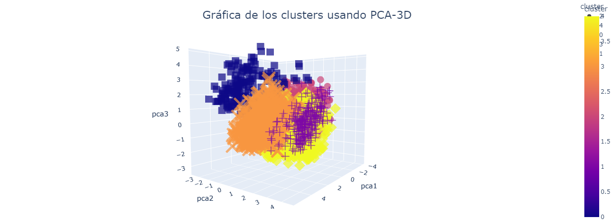

# Segmentación de Clientes | Marketing

Bienvenidos!! a este proyecto de Machine Learning ha sido desarrollado para una tienda online en Seattle, Estados Unidos. La empresa ha contratado nuestros servicios de consultoría de Data Science para mejorar sus campañas de marketing enfocadas en cada segmento específico y perfil de cliente.

La segmentación de clientes es una técnica esencial en el área de marketing que consiste en dividir a los clientes en grupos homogéneos en función de ciertas características, como edad, género, ubicación geográfica, nivel de ingresos y otros factores. Esta segmentación permite a las empresas enfocar sus esfuerzos de marketing en los clientes más propensos a comprar sus productos o servicios, y maximizar así el retorno de la inversión en publicidad y otras actividades de marketing.

Hay muchas razones por las que la segmentación de clientes es importante para el área de marketing. Algunas de ellas incluyen:

<li>Mejora la efectividad de las campañas de marketing.</li>
<li>Ayuda a ahorrar dinero.</li>
<li>Facilita la toma de decisiones.</li>

Para alcanzar los objetivos propuestos, hemos realizado un análisis exploratorio de los datos proporcionados por la empresa y hemos creado gráficos interactivos con la librería Plotly. Además, hemos implementado la teoría de los autoencoders con Keras y Tensorflow para reducir la dimensión del dataset y hemos aplicado el algoritmo de K-Means para segmentar los datos de los clientes.

También hemos utilizado la técnica de Análisis de Componentes Principales (ACP) para reducir la dimensión del dataset y hemos realizado una ingeniería de características óptima para tratar los datos faltantes o nulos.

En resumen, hemos cumplido con los objetivos generales y específicos establecidos para este proyecto de Machine Learning. Hemos desarrollado un análisis exhaustivo de los datos y hemos aplicado técnicas de reducción de dimensión y segmentación de datos para mejorar las campañas de marketing de la empresa.

Esperamos que este proyecto haya sido de utilidad para la empresa y que haya ayudado a mejorar sus campañas de marketing enfocadas en cada segmento y perfil de cliente. Estamos dispuestos a seguir trabajando en futuros proyectos y a seguir ofreciendo nuestros servicios de consultoría de Data Science puedes revisar más proyectos en <a href="https://royquillca.github.io/portfolio/">royquillca/portfolio</a>

Así mismo puedes ya revisar la situacion problemática y los objetivos establecidos así como el código y su respectiva implementación en el <a href="https://github.com/royquillca/segmentacion_mkt/blob/main/mkt.ipynb">NoteBook de Segmentación de Clientes con Machine Learning y Deep Learning - Marketing</a>

